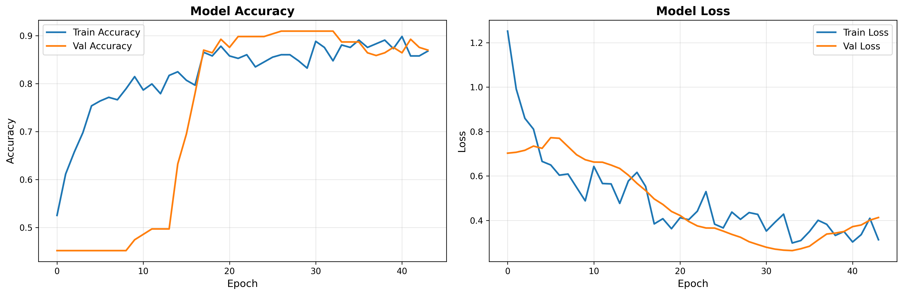

# 🍅 ỨNG DỤNG CNN TRONG PHÂN LOẠI CÀ CHUA THEO ĐỘ CHÍN

## 🌱 Giới thiệu
Đề tài này nghiên cứu và xây dựng mô hình **Mạng nơ-ron tích chập (Convolutional Neural Network - CNN)** để **phân loại cà chua theo độ chín** thành hai nhãn:
- 🟢 **Xanh (Unripe)**
- 🔴 **Chín (Ripe)**

Dự án được thực hiện trong khuôn khổ môn học **Trí tuệ nhân tạo (AI)** tại **Trường Đại học Công nghiệp Hà Nội (HAUI)**.  
Mã nguồn được phát triển bằng ngôn ngữ **Python** và thư viện **TensorFlow/Keras**.


*(Biểu đồ quá trình huấn luyện mô hình)*

---

## 🎯 Chức năng chính
1. **Huấn luyện:** Xây dựng mô hình CNN tự động lưu trọng số tốt nhất.
2. **Đánh giá:** Tính toán độ chính xác (Accuracy), vẽ Ma trận nhầm lẫn (Confusion Matrix).
3. **Dự đoán (Inference):** Nhận diện độ chín từ một file ảnh bất kỳ bên ngoài.

---

## ⚙️ Cấu trúc thư mục

```bash
PROJECT_TOMATO/
│
├── .venv/                   # Môi trường ảo Python
├── data/                    # Dữ liệu ảnh
│   ├── train/               # Ảnh dùng để huấn luyện (Data Augmentation)
│   ├── val/                 # Ảnh dùng để đánh giá quá trình train
│   └── test/                # Ảnh dùng để kiểm thử độc lập
│
├── models/                  # Nơi lưu trữ mô hình và log
│   ├── best_model.h5        # File trọng số tốt nhất đã train
│   ├── training_history.npy # File lịch sử huấn luyện (numpy)
│   └── training_history.png # Biểu đồ trực quan Accuracy/Loss
│
├── src/                     # Mã nguồn chính
│   ├── data_prep.ipynb      # Notebook xử lý/khám phá dữ liệu (Jupyter)
│   ├── train.py             # Script huấn luyện mô hình
│   ├── evaluate.py          # Script đánh giá & vẽ Confusion Matrix
│   └── infer.py             # Script dự đoán ảnh đơn lẻ (Ứng dụng thực tế)
│
├── README.md                # Tài liệu hướng dẫn
├── requirements.txt         # Danh sách thư viện
└── .gitattributes           # Cấu hình Git
🛠️ Cài đặt môi trường
Dự án sử dụng trình quản lý gói uv (hoặc pip chuẩn).

1️⃣ Cài đặt công cụ
Bash

pip install uv

2️⃣ Tạo môi trường & Cài thư viện
Bash

# Tạo môi trường ảo
uv venv

# Kích hoạt môi trường (Windows)
.venv\Scripts\activate

Cài đặt tất cả thư viện cần thiết bằng lệnh:
```bash
python -m pip install -r requirements.txt

🚀 Hướng dẫn sử dụng
1. Huấn luyện mô hình (Training)
Quá trình này sẽ đọc ảnh từ data/train, huấn luyện 50 epochs và lưu model vào models/best_model.h5.

Bash

python src/train.py

# Hoặc dùng uv:
uv run src/train.py

2. Đánh giá mô hình (Evaluation)
Script này tính toán độ chính xác trên tập dữ liệu kiểm thử và vẽ biểu đồ nhầm lẫn để xem model hay sai ở đâu.

Bash

python src/evaluate.py

3. Dự đoán ảnh mới (Inference)
Dùng để kiểm tra một tấm ảnh cà chua bất kỳ (tải từ mạng hoặc chụp điện thoại).

Cách 1: Chạy chế độ tương tác (Kéo thả ảnh vào)

Bash

python src/infer.py

Cách 2: Chạy bằng dòng lệnh

Bash

python src/infer.py --image "data/test/ca_chua_xanh_01.jpg"

🧬 Kiến trúc mô hình CNN
Mô hình sử dụng kiến trúc tuần tự (Sequential) với 4 khối tích chập:
-----------------------------------------------------------------------------
| Block  |	Loại lớp (Layer)        |  Bộ lọc (Filters)   | Output Shape    |
| Input  |	    Image	            |       -	          | (128, 128, 3)   |
|   1	 |  Conv2D + BN + MaxPool   |       32	          | (64, 64, 32)    |
|   2	 |  Conv2D + BN + MaxPool	|       64	          | (32, 32, 64)    |
|   3	 |  Conv2D + BN + MaxPool	|       128	          | (16, 16, 128)   |
|   4	 |  Conv2D + BN + MaxPool	|       256	          | (8, 8, 256)     |
|   FC	 |  Flatten + Dense	        |    64 neurons	      | Vector          |
|   FC	 |      Dense	            |    128 neurons	  | Vector          |
| Output |  Dense (Softmax)         |    2 neurons	      | (Xanh, Chín)    |
-----------------------------------------------------------------------------

📊 Kết quả thực nghiệm
(Số liệu ví dụ dựa trên lần huấn luyện gần nhất)
- Training Accuracy: ~90%
- Validation Accuracy: ~88%
- Loss: Hội tụ tốt sau khoảng 20 epochs.

## 🌐 Hướng dẫn chạy Website (Web Interface)

Dự án bao gồm một giao diện web đơn giản giúp người dùng tải ảnh lên và nhận kết quả dự đoán từ mô hình AI.

### 1. Yêu cầu môi trường
Đảm bảo bạn đã cài đặt các thư viện cần thiết cho Backend. Mở Terminal và chạy:

```bash
# Cài đặt Flask và các thư viện hỗ trợ

python -m pip install flask flask-cors pillow tensorflow

2. Khởi động Backend (Server AI)
Server này đóng vai trò nhận ảnh từ web, đưa vào mô hình xử lý và trả về kết quả.

Mở Terminal tại thư mục gốc của dự án (project_tomato).

Chạy lệnh sau:

Bash

python src/app.py

Khi thấy dòng thông báo sau hiện ra, nghĩa là Server đã sẵn sàng:

Running on [http://0.0.0.0:5000](http://0.0.0.0:5000)

⚠️ Lưu ý: Đừng tắt cửa sổ Terminal này trong quá trình sử dụng web.

3. Mở giao diện Frontend
Truy cập vào thư mục dự án.

Tìm file index.html.

Nhấp đúp chuột (Double click) để mở file này trên trình duyệt (Chrome, Edge, Firefox...).

Mẹo: Nếu dùng VS Code, bạn có thể chuột phải vào file và chọn "Open with Live Server" (nếu đã cài Extension) để có trải nghiệm tốt hơn.

4. Cách sử dụng
Tại giao diện web, nhấn vào khung "Tải ảnh lên" hoặc kéo thả ảnh cà chua vào đó.

Chờ khoảng 1-2 giây để AI phân tích.

Kết quả (Xanh/Chín) và độ tin cậy (%) sẽ hiển thị ở cột bên phải.

🛠️ Khắc phục lỗi thường gặp
Lỗi 1: Bấm tải ảnh nhưng không thấy phản hồi hoặc báo lỗi kết nối.

Nguyên nhân: Bạn chưa chạy Backend hoặc đã vô tình tắt cửa sổ Terminal chạy app.py.

Khắc phục: Kiểm tra lại Bước 2, đảm bảo Server đang chạy ở cổng 5000.

Lỗi 2: ModuleNotFoundError: No module named 'flask'

Nguyên nhân: Chưa cài đặt thư viện Flask.

Khắc phục: Chạy lại lệnh cài đặt ở Bước 1.

Lỗi 3: Web báo "Lỗi từ AI"

Nguyên nhân: Có thể file ảnh bị lỗi hoặc mô hình .h5 chưa được tạo.

Khắc phục: Đảm bảo bạn đã chạy train.py để tạo ra file models/best_model.h5 trước đó.